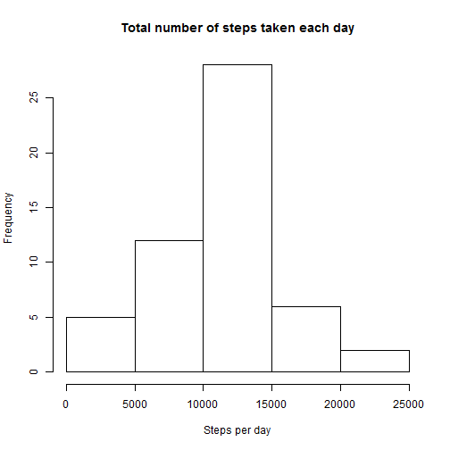

Reproducible Research - Peer Assessment 1 - May 19
======================================================================

## Loading and preprocessing the data

```r
options(scipen = 999)
setwd("C:/Users/roadrunner/Desktop/DS Specialization")
data <- read.csv("activity.csv", header = TRUE)
```


## What is mean total number of steps taken per day?

Code to plot a histogram of the total number of steps taken each day

```r
steps_per_day <- tapply(data$steps, data$date, sum)
hist(steps_per_day, main = "Total number of steps taken each day", xlab = "Steps per day")
```

 


Code to compute mean and median total number of steps taken per day

```r
mean_steps_per_day <- mean(steps_per_day, na.rm = TRUE)
median_steps_per_day <- median(steps_per_day, na.rm = TRUE)
```


1. Mean total number of steps taken per day: 10766.1887
2. Median total number of steps taken per day: 10765

## What is the average daily activity pattern?

Code to plot the time series plot of the 5-minute interval (x-axis) and the average number of steps taken, averaged across all days (y-axis)

```r
avg_steps <- tapply(data$steps, data$interval, mean, na.rm = TRUE)
avg_steps_df <- as.data.frame(avg_steps)
avg_steps_df$interval <- rownames(avg_steps_df)
plot(avg_steps_df$interval, avg_steps_df$avg_steps, type = "l", main = "Time Series Plot", 
    xlab = "interval", ylab = "average steps taken across all days")
```

 


Code to compute which 5-minute interval, on average across all the days in the dataset, contains the maximum number of steps

```r
max_avg_steps <- max(avg_steps_df$avg_steps)
interval_max_steps <- avg_steps_df[(avg_steps_df$avg_steps == max_avg_steps), 
    "interval"]
```


Interval that contains maximum number of steps, on average across all the days in the dataset: 835  

## Imputing missing values

```r
na_values_count <- nrow(data[(!complete.cases(data)), ])
```

The total number of missing values in the dataset: 2304

*Strategy for imputing missing data: Missing values are filled in with the mean total steps taken per day, that is 10766.1887*

Code for: 
- Filling in all the missing values with mean total steps taken per day
- Creating new dataset which has no missing data
- Making a histogram of the total number of steps taken each day

```r
data_new <- data

data_new[is.na(data_new)] <- mean_steps_per_day
steps_per_day_new_data <- tapply(data_new$steps, data_new$date, sum)

mean_steps_per_day_new_data <- mean(steps_per_day_new_data, na.rm = TRUE)
median_steps_per_day_new_data <- median(steps_per_day_new_data, na.rm = TRUE)

hist(steps_per_day_new_data, main = "Total number of steps taken each day", 
    xlab = "Steps per day")
```

 


For the new data,  
1. Mean total number of steps taken per day: 415998.4708  
2. Median total number of steps taken per day: 11458

## Are there differences in activity patterns between weekdays and weekends?

Code for: 
- Creating new factor variable in dataset with 2 levels: weekday, weekend
- Making a panel plot containing a time series plot (i.e. type = "l") of the 5-minute interval (x-axis) and the average number of steps taken, averaged across all weekday days or weekend days (y-axis).

```r
data_new$day_name <- weekdays(as.Date(data_new$date))
data_new$day <- NA
data_new[(data_new$day_name %in% c("Saturday", "Sunday")), "day"] <- "weekend"
data_new[!(data_new$day_name %in% c("Saturday", "Sunday")), "day"] <- "weekday"


data_new_wkd <- data_new[(data_new$day == "weekday"), ]
avg_steps_wkd <- tapply(data_new_wkd$steps, data_new_wkd$interval, mean, na.rm = TRUE)
avg_steps_wkd_df <- as.data.frame(avg_steps_wkd)
avg_steps_wkd_df$interval <- rownames(avg_steps_wkd_df)

data_new_wke <- data_new[(data_new$day == "weekend"), ]
avg_steps_wke <- tapply(data_new_wke$steps, data_new_wke$interval, mean, na.rm = TRUE)
avg_steps_wke_df <- as.data.frame(avg_steps_wke)
avg_steps_wke_df$interval <- rownames(avg_steps_wke_df)

par(mfrow = c(2, 1))
plot(avg_steps_wkd_df$interval, avg_steps_wkd_df$avg_steps_wkd, type = "l", 
    main = "Time Series Plot - weekdays", xlab = "interval", ylab = "avg steps taken across weekdays")
plot(avg_steps_wke_df$interval, avg_steps_wke_df$avg_steps_wke, type = "l", 
    main = "Time Series Plot - weekends", xlab = "interval", ylab = "avg steps taken across weekends")
```

 


